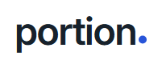
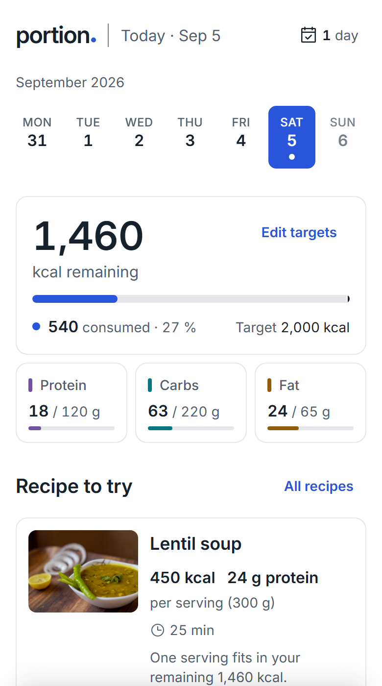
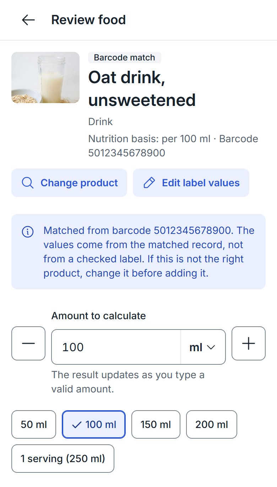
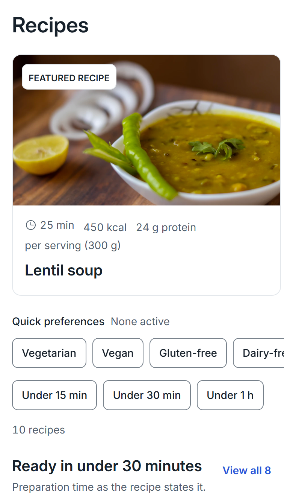
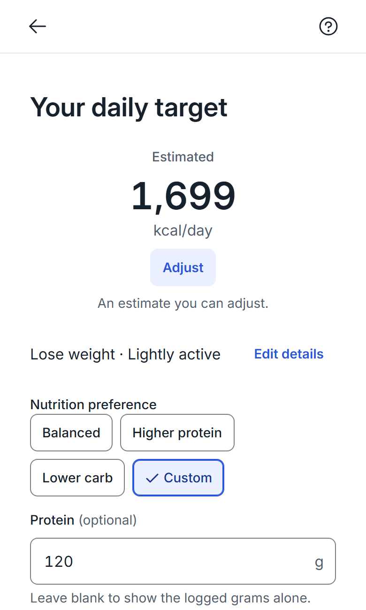

  <picture>
    <source media="(prefers-color-scheme: dark)" srcset="docs/assets/readme/portion-logo-dark.png">
    
  </picture>

<strong>Understand your portion. Find recipes that fit.</strong>

**Portion** is an interactive mobile prototype for two everyday food decisions: working out the calories in a specific dish or product, and finding a recipe that actually fits chosen criteria. It began as a UX/UI design test task — this GitHub repository is named `portion-jito-test-task`, and the package and Figma/FigJam files still carry the assignment's original working name, `jito-calories-calculator`. The project covers the full design process: secondary research and competitive analysis, UX synthesis and task flows, a visual direction, and a reusable design system, brought to life as an interactive prototype — verified in Storybook rather than left as static screens.

## Explore the project

**Prototype**

- [ **Interactive prototype**](https://portion-ochre.vercel.app/) — the implemented app, running live.

**Research & planning** (FigJam)

- [ **Brief & Scope**](https://www.figma.com/board/Np6ZrdnQKjVw7tZw8W51kT/jito-calories-calculator?node-id=0-1&t=RMW2GuKy2AItAgSq-1) — the original assignment and its boundaries.
- [ **Product Research & Competitive Analysis**](https://www.figma.com/board/Np6ZrdnQKjVw7tZw8W51kT/jito-calories-calculator?node-id=0-1&t=RMW2GuKy2AItAgSq-1) — secondary research and six competitor teardowns.
- [ **UX Synthesis & Design Hypotheses**](https://www.figma.com/board/Np6ZrdnQKjVw7tZw8W51kT/jito-calories-calculator?node-id=4-333&t=RMW2GuKy2AItAgSq-1) — needs, JTBD and the four design hypotheses.
- [ **Task Flows**](https://www.figma.com/board/Np6ZrdnQKjVw7tZw8W51kT/jito-calories-calculator?node-id=4-334&t=RMW2GuKy2AItAgSq-1) — the two core journeys as flow diagrams.

**Design** (Figma)

- [ **Low-fidelity wireframes**](https://www.figma.com/design/heuO3V1WlKG44CukQswCkw/jito-calories-calculator?node-id=0-1&t=urjsytdSqhdIRbXu-1) — the screen and state inventory that preceded visual design.
- [ **Branding / Stylescape**](https://www.figma.com/design/heuO3V1WlKG44CukQswCkw/jito-calories-calculator?node-id=92-1209&t=urjsytdSqhdIRbXu-1) — direction comparison, the selected "Measured Clarity" system and its rationale.
- [ **UI Kit**](https://www.figma.com/design/heuO3V1WlKG44CukQswCkw/jito-calories-calculator?node-id=28-2253&t=urjsytdSqhdIRbXu-1) — the destination for the design system to be transferred from code (not yet done — see [Outcome and current boundaries](#outcome-and-current-boundaries)).
- [ **High-fidelity screens**](https://www.figma.com/design/heuO3V1WlKG44CukQswCkw/jito-calories-calculator?node-id=3-2&t=urjsytdSqhdIRbXu-1) — the destination for the implemented screens to be transferred from code (not yet done — see [Outcome and current boundaries](#outcome-and-current-boundaries)).

**Design system**

- [ **Storybook — Components & States**](https://fa5e9c0f1f3c592fd9c920eb4b2181db.share.chromatic.com/?path=/docs/start-here-introduction--docs) — every reusable primitive, component and pattern with its documented states.

**Walkthrough**

- [ **Video walkthrough**](https://drive.google.com/file/d/1MNwQGoy5W4RxM7td6Wd8_5eVhdRaJRkf/view?usp=sharing)

 

  

<em>Home on a day with food already logged: the day strip, the calorie budget, three macro cards and one recipe recommendation — before the meal list and water tracker, further down the same screen.</em>

## Why this project exists

The brief asked for the key mobile experiences of a "Calories Calculator" app, anchored on two given user stories: calculate the calories in a dish or product, and find a recipe suitable for the user, with the explicit objectives of reducing unnecessary steps, presenting nutrition clearly, making suitability easy to evaluate, and building the result from a reusable design system ([brief](docs/project/brief.md)). Everything else in the product — Home's daily overview, meals, water, streak and optional targets — is scoped as *optional supporting context around those two jobs*, not a requirement in its own right: [PRODUCT.md](PRODUCT.md) and the [visual direction](docs/design/visual-direction.md) are explicit that neither calculating a result nor choosing a recipe ever depends on logging, a goal or an account. That is a deliberate scope decision, not an oversight — it keeps the two given jobs usable on their own while giving a committed entry somewhere honest to land (a meal, a day).

Constraints were also explicit from the start: no accounts or onboarding, no medical or health-scoring claims, no production food-recognition or nutrition backend — barcode and photo input run on deterministic, labelled fixtures, and the product says so on screen rather than implying a live service.

## My role and contribution

I'm **Ivan Makukha**. I owned the product and UX decisions end to end: the research synthesis and design hypotheses, the task flows and screen/state inventory, the visual direction and its trade-offs, the design-system contracts, and the acceptance criteria each implementation pass had to satisfy — recorded as a running [decisions ledger](docs/design/hifi-decisions.md) rather than asserted after the fact.

Implementation was AI-assisted with Claude Code, directed against those contracts: it wrote the token pipeline, primitives, components, patterns and screens, drafted the verification scripts, and produced the screenshots used to check its own work. I reviewed that output by reading the rendered Storybook and runtime captures rather than trusting generated code at face value; an independent code-review agent pass over the implementation branch caught two further latent defects (a layout-padding race condition, a token-generator edge case), both fixed and re-verified before merging ([ai-workflow.md](docs/project/ai-workflow.md), [design-system guide §8](docs/design-system/README.md)). Figma access during implementation was read-only evidence-gathering — pulling low-fidelity frames and stylescape content into the ledger — never a channel for redesigning the accepted direction.

## From UX evidence to product decisions

A few of the clearer chains from evidence to shipped behaviour:

| Evidence / hypothesis | Decision | Implemented as | Intended benefit |
| --- | --- | --- | --- |
| Competitor teardown: logging is diary-first by default; [research synthesis](docs/ux/research/synthesis.md) — "focus the experience on the task, not the tracking system" | Calculating a result never requires an account, a goal or a saved log | Home works at zero entries; a food task can show a result without `Add to {meal}` ever being pressed | An answer to "how many calories is this," with no tracking commitment |
| [H2 — Editable Assumptions](docs/ux/ux-synthesis-and-design-hypotheses.md): food, quantity and portion assumptions must stay visible and correctable | A barcode or photo match is a labelled, correctable *suggestion*, never an asserted fact | "Barcode match" / "Photo suggestion" badges plus a named correction action; a correction becomes a provenance-tagged manual override, the shared catalogue stays untouched | The person, not a black box, has final say over what gets counted |
| [H4 — Explainable Recipe Suitability](docs/ux/ux-synthesis-and-design-hypotheses.md); RR-04: no "universal healthy score" | Recipe results state *which* active filters they meet, never a rating or a computed score | `MatchCriteria` renders "Matches all N filters" only when criteria are active and the values are known, AND-combined | Comparing options at a glance, without opening every recipe or trusting an opaque number |
| Reference R6 (Etsy-style query-free browsing), [visual-direction.md §8](docs/design/visual-direction.md) | Recipes' root screen is curated discovery, not a search box; full-text search lives separately | Featured recipe, quick preferences and thematic rails on the root; the full catalogue and text search live in Search's Recipes scope | Browsing and finding are different needs, each with a fitted interface instead of one compromise |
| Non-goal: no mandatory or automatic target ([PRODUCT.md](PRODUCT.md)); [targets & estimation](docs/ux/targets-and-estimation.md) | Even a science-based estimate stays a draft until explicitly saved | "Help me estimate" runs the National Academies' 2023 EER equations, then always lands on a full-screen review with `Adjust`, before `Save targets` | Nutrition science informs the number; the person stays the authority over their own target |
| *Trade-off*, [visual-direction.md §3](docs/design/visual-direction.md): "blue alone is generic" | Recognition comes from the wordmark, neutral numerals and structure, not colour; calories and macros stay neutral ink, never "good/bad" tinted | Feedback colours are reserved for system states; the calorie and macro figures never recolour for being under, at or over target | Avoids the evaluative, gamified feel common to tracking apps |

## What the product lets people do

**Calculating calories** starts from any of four methods — search, barcode, photo or manual entry — and all four converge on one portion form: an amount with steppable presets drawn only from that item's own units (no invented g↔serving conversions), a live recalculation, a meal choice, and a single final `Add to {meal}`. There is no second confirmation sheet. Missing nutrition reads as "Not available," never as zero, and every source-specific correction (`Change product`, `Edit label values`, `Change match`, `Retake photo`) is visible before that final action, not after.

  

<em>A barcode match is presented as a match, not a verified fact — with an explicit correction path before anything is added.</em>

**Finding a recipe** starts from curated discovery (a featured recipe, quick dietary/time preferences, thematic rails) or from Search's Recipes scope, which holds the full catalogue, text search and a numeric filter sheet. Criteria combine with AND; a result only claims a match when the criteria are active and the recipe's own data supports it.

  

<em>Discovery without a search field: preferences and collections instead — full-text search lives in Search's Recipes scope.</em>

**Home** shows one selected day at a time — never a weekly or long-term analytics view — with a calorie/macro summary that has no bar, percentage or remainder at all until a target exists, meals grouped as Breakfast/Lunch/Dinner/Snacks (empty ones included, each with its own `Add`), and a water tracker with a quick `+250 ml` and Undo. A daily target is entirely optional; setting one runs either a direct entry or the reviewable DRI-based estimate below.

  

<em>The estimate always ends on a review the person must explicitly save — adjustable, never auto-applied.</em>

Across both journeys, empty, loading, no-match, request-failure, validation and cancellation states are implemented and screenshotted, not just the populated path — [the tracked evidence set](verification/manifest.md) covers 61 runtime states and 167 Storybook-rendered states as of this writing, each read and annotated rather than only generated. One exit policy (an untouched task exits immediately; an edited one asks via a shared `Discard changes?`) applies to every food-entry surface, so leaving a flow behaves the same way everywhere.

## Visual identity and the reusable system

The direction — "Measured Clarity" — was chosen from a documented comparison against a warmer alternative, on the stated grounds that neutral surfaces and ink-coloured numerals keep results legible and non-evaluative next to food photography, not because blue tested better ([visual-direction.md §3](docs/design/visual-direction.md)). Inter is the only typeface; a seven-step spacing scale and seven radius roles (control, card, sheet, grouped, round…) keep nested corners concentric instead of ad hoc. Every screen is assembled from the same layer stack — tokens → primitives → components → patterns → templates — so a change to, say, `ProgressBar`'s unavailable state shows up identically on the calorie card, the macro cards and the recipe filters. That reuse is what the 88 current Storybook story files and the design-system guide's [coverage register](docs/design-system/README.md) exist to make checkable: for each requirement, which component implements it, which story exercises it, and what was actually run against it.

Responsiveness and accessibility are treated as verifiable, not assumed: stories and the runtime walkthrough are captured at 320/390/430 CSS px and at 200% text, axe accessibility checks run at error severity on every story, and a generated contrast matrix recomputes every token pair the product actually uses against WCAG 2.2 AA.

## How the work was developed and checked

The sequence was research first, then implementation directly in code — not a conventional "finish Hi-Fi in Figma, then build" handoff. Secondary research and a six-app competitive teardown (FigJam) fed a synthesis of four design hypotheses and derived UX requirements; those became two task-flow diagrams and a low-fidelity screen/state inventory (Figma); a stylescape compared two visual directions and selected one. From there, the Hi-Fi visual system was built and iterated **in code and Storybook** against that stylescape — tokens, then primitives, components, patterns, templates and screens — with each revision (the initial redesign, a "Stage B" populated Food tab, revisions R1–R6, H2 and T1) closing on a runtime walkthrough script, a Storybook capture script, and a written ledger entry recording what was checked and found. Capturing the finished screens back into the Figma Hi-Fi/UI-Kit destinations linked above is a separate, documented, **not yet executed** step ([figma-transfer-contract.md](docs/design/figma-transfer-contract.md)) — the repository and Storybook remain the current source of truth for implemented UI, per the project's own authority order.

The repository's own last recorded full verification run (typecheck, token/drift check, unit and Storybook Vitest projects with axe at error severity, app and Storybook builds, and the contrast matrix — [design-system guide §6](docs/design-system/README.md)) is dated 2026-09-04 and was not re-executed for this documentation update; counts quoted above (88 story files, 20 test files, 61 tracked runtime screenshots, 167 tracked Storybook captures) were counted directly from the repository while writing this document. The project ran from its first commit to its most recent over roughly a week (31 August – 7 September 2026), through short-lived branches merged via pull request.

## Outcome and current boundaries

What's here is inspectable, not asserted: Storybook stories, a hosted preview, and a decisions ledger connecting research to design hypotheses. That traceability — not a claim of "high quality" on its own — is what makes the work checkable.

**Honest limits:**
- **Data & Features:** Barcode/photo recognition and all nutrition and recipe content are deterministic, labelled fixtures — this is a prototype, not a live service.
- **Research Scope:** Research relies on secondary and competitive analysis. No user interviews or usability sessions were conducted, so the core design hypotheses remain hypotheses rather than validated findings.
- **Accessibility:** Accessibility checks focus on computed contrast, automated contrast checks, and basic responsive layout behaviour — not a full WCAG 2.2 AA audit or an assistive-technology pass.
- **Figma Assets & Documentation:** The repository and Storybook serve as the primary source of truth for code-level implementation and full component state matrices. The Figma files contain interactive High-Fidelity screens with prototype flows and transitions, alongside the core UI Kit components.

The most direct way to see how these decisions hold together is to open the interactive prototype and run both user journeys, then compare a component's Storybook states against how it functions in the user flows.
