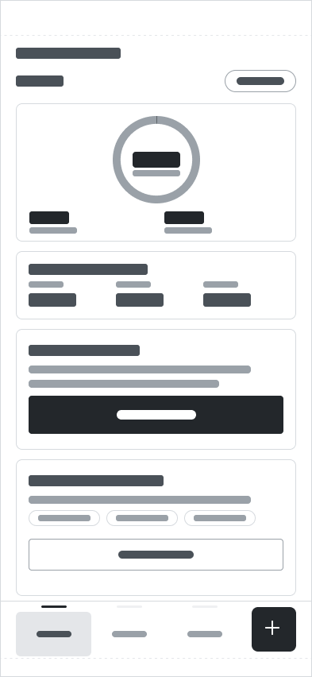
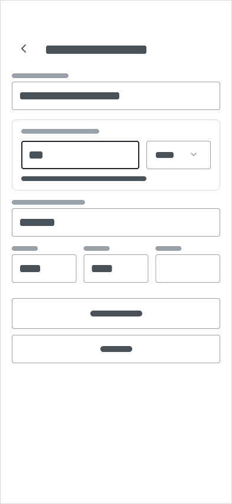
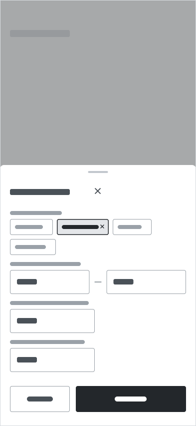
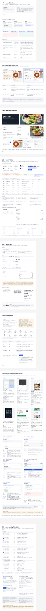

# Portion Pre-Hi-Fi UX Audit

Date: 2026-09-04  
Repository baseline: `feat/navigation-hifi` at `9d4a99b`  
Audit mode: combined UX and observable accessibility-risk audit  
Status of recommendations: Proposed

## 1. Scope, sources, and evidence limits

This audit evaluates the two required user goals:

1. Calculate calories for a product or dish.
2. Find a suitable recipe.

It also evaluates the accepted shared navigation: **Home**, **Search**, **Recipes**, and the separate **Log food** action. Home is treated as authoritative; Calculate is not treated as a root destination.

### Audited sources

- Repository contracts: `AGENTS.md`, `CLAUDE.md`, `PRODUCT.md`, `DESIGN.md`, `README.md`, `docs/ux/low-fidelity.md`, and `docs/ux/ui-contract.md`.
- Figma Design, read-only:
  - low-fidelity page `0:1`, including the important S01-S08 and O01-O04 frames;
  - branding/stylescape node `92:1209`.
- FigJam, read-only structured inspection:
  - brief and scope `0:1`;
  - task flows `4:334` (calorie section `66:3473`, recipe section `75:332`);
  - product research and competitive analysis `5:337`;
  - UX synthesis and design hypotheses `4:333`.
- Current implementation and the directly relevant Storybook stories only:
  - `src/app/App.tsx` and `src/app/App.stories.tsx`;
  - Home, Search, Barcode, Photo, Manual entry, Food review, Recipes, and Recipe details screens and their stories;
  - NavigationBar, MethodSheet, RecipeCard, RecipeList, and RecipeFiltersSheet and their stories;
  - fixture-backed service behavior in `src/app/services.ts`.

### Evidence limits

- Figma low-fidelity interiors intentionally use neutral placeholder bars. They establish hierarchy, grouping, controls, and state presence, but cannot establish final wording, comprehension, numeric readability, or trust-copy quality.
- Figma MCP supplied static screenshots and node metadata. Prototype reactions, scroll restoration, dismissal origins, keyboard behavior, asynchronous cancellation, and state persistence were not executed in Figma.
- FigJam was inspected as structured canvas content rather than as exported screenshots.
- The app and Storybook were inspected in source only in this audit. Existing story definitions are supporting evidence of intended coverage, not proof that the current stories pass or that the rendered runtime behaves correctly.
- No new competitor research was run. The existing research board was used only to understand the rationale already on record.
- Static screenshots cannot confirm keyboard operation, focus containment/restoration, screen-reader output, announcements, contrast of final colors, safe-area behavior, software-keyboard behavior, or 200% text reflow. Those remain test obligations.

### Severity scale

- **1 — Minor:** low task impact; primarily a validation or polish risk.
- **2 — Moderate:** noticeable ambiguity, inconsistency, or incomplete recovery that can slow or confuse users.
- **3 — Serious:** a structural conflict or broken flow contract likely to cause wrong implementation or loss of context.
- **4 — Critical:** prevents completion of a required user goal. No severity-4 issue was confirmed in the available evidence.

## 2. Readiness verdict

## Not ready for Hi-Fi

The core UX direction is coherent, and much of the current React/Storybook source is already stronger than the low-fidelity artifacts. However, Hi-Fi should not proceed yet because the artifacts disagree on several behavior-defining decisions:

- the current app can lose the invoking surface when **Search food** is chosen from O01;
- the FigJam calorie flow and Figma S07-3 still describe superseded single-calculation/replacement behavior;
- the only 320 px Figma Home witness still shows the superseded current-calculation Home;
- Figma does not yet witness goal editing, logged-entry editing/removal, or important daily-data states;
- Figma and code use different interaction models for choosing a photo suggestion;
- the stylescape and some low-fidelity layer names still use stale **Add food**, generic confirm/cancel, or method-commit language.

These are structural and semantic issues, not unfinished visual polish. Styling them now would make the Hi-Fi source ambiguous and increase rework.

## 3. Walkthrough — goal 1: calculate calories for a product or dish

### Step 1 — Enter from Home

**Health: Strong structure, incomplete source alignment.** Home gives both required jobs visible entry points without requiring a goal or diary workflow. The daily overview is bounded and the separate plus action is visible. The same canvas still contains a contradictory 320 px Home specimen; see F-03.

### Step 2 — Choose an identification method

**Health: Strong.** O01 presents four parallel methods in one modal surface, with an explicit close control and no unnecessary Continue step. This supports recognition over recall and keeps barcode/photo automation optional. The app source and MethodSheet stories add useful disclosure that method choice does not log food.

### Step 3 — Search and select a food

**Health: Strong within Search; return behavior at risk.** Search has a visible Food/Recipes scope, a clear query field, result status, scannable rows, and the shared navigation. Selecting a result leads to review. However, when Search food is launched from O01 over Home, Recipes, or Recipe Details, the current app switches the root to Search and clears the focused-flow stack, so later Done cannot restore the original surface; see F-01.

### Step 4 — Review identity, portion, and result

**Health: Strong product logic, stale Figma action semantics.** The screen exposes identity, a correction route, desired amount and unit, the calorie result, its basis, and supporting macros. Focused review correctly removes the root bar. Current code uses **Add to today** as an optional commit and **Done** as a no-log exit, but this Figma frame still names the controls generic confirm/cancel; see F-02 and F-06.

### Step 5 — Recover from an invalid portion

**Health: Strong.** The invalid field remains editable, guidance is adjacent, the old result is visually unavailable, and the commit action is unavailable. This directly supports error prevention and prevents users from treating a stale calorie value as current.

### Step 6 — Recover from a readable barcode with no matching product

**Health: Strong.** The scan is paused and the state is separated from unreadable-code and service-failure cases. Recovery offers Search, Manual entry, and Rescan rather than presenting missing data as zero. Current implementation copy preserves and identifies the read code.

### Step 7 — Review a photo suggestion

**Health: At risk because the interaction contract differs.** Figma shows a selected suggestion plus **Review selected match**, while the current React screen opens Food review immediately when a suggestion row is activated. Both can support explicit correction, but they have different step counts, focus behavior, and state requirements; see F-05.

### Step 8 — Recover from manual-entry validation

**Health: Strong.** The invalid reference amount is associated with its field while other entered values remain in place. Current source validates on Continue, focuses the first invalid field, treats blank optional macros as unknown, and protects a meaningful dirty draft with Keep editing/Discard.

### Goal-1 completion health

The required calorie answer is available in Food review before any logging decision. This matches the JTBD and the research synthesis: calculation is a focused, correctable task, not a mandatory diary workflow. Completion is not blocked in the main Search path, but invoking-surface loss and stale Figma/task-flow semantics must be resolved before visual refinement.

## 4. Walkthrough — goal 2: find a suitable recipe

### Step 1 — Browse recipes

**Health: Strong.** Recipes supports query-free browsing, a separate search entry, filters, scannable cards, and the Recipes-selected root state. This is consistent with the accepted IA and does not require users to know a recipe name in advance.

### Step 2 — Set criteria

**Health: Strong.** Dietary preference, calorie range, protein minimum, and preparation maximum are grouped in one draft. Apply and Reset are distinct, and the footer is designed not to cover the last field. Current source states that every active filter is combined with AND and includes the important “not an allergen check” caveat.

### Step 3 — Compare filtered results

**Health: Strong.** Applied criteria remain visible and removable. Match evidence appears only when criteria are active, while calories, protein, portion basis, time, and dietary facts support comparison. The result design avoids an unexplained health score or generic suitability claim.

### Step 4 — Open a recipe and wait for details

**Health: Strong structure, behavior not executed.** Loading is visibly distinct from empty and failed results. Back remains available and the originating root selection remains visible. The contract requires a late response to be ignored after Back; source code contains request invalidation, but this was not executed in the current audit.

### Step 5 — Evaluate recipe details

**Health: Strong.** Details preserve the serving basis, nutrition, dietary/time context, ingredients, and method. The current React screen adds criterion-by-criterion evidence when filters are active and omits match claims when no criteria exist. No mandatory Save, Cook, or logging step is introduced.

### Step 6 — Recover from an unavailable detail

**Health: Strong state design, incomplete runtime reachability.** Retry and Back to results are both explicit, and the origin bar remains. The current runtime service has no reachable failure result for a recipe selected from the available catalogue, so this recovery is presently demonstrated by the screen story rather than by the integrated app; see F-09.

### Step 7 — Recover from no matches

**Health: Strong.** The query and applied criteria are retained, and recovery distinguishes changing criteria from clearing them. This is correctly separate from network failure and cannot open Recipe Details.

### Goal-2 completion health

The recipe journey is structurally complete from browse/search through criteria, comparison, details, no matches, and detail failure. The match model is explainable and appropriately neutral. The remaining risk is integration evidence: the runtime does not expose all failure branches, and the full recipe journey/back restoration is not covered by the current App stories inspected here.

## 5. Confirmed strengths

1. **The root IA is now coherent.** Contracts, current code, and the main Figma frames use Home, Search, and Recipes with a separate Log food action. Calculate is treated as a capability, not a destination.
2. **Home remains bounded.** It supports today’s calorie context, optional goal/logging, direct food entry, and recipe discovery without expanding into history, coaching, or a generic tracking dashboard.
3. **Food results are correctable and contextual.** Identity, reference basis, desired portion, calories, available macros, and change routes appear together before optional logging.
4. **Automation is not presented as certainty.** Barcode and photo routes converge on review; the current implementation labels simulated camera/recognition/database behavior and states that a photo does not measure the portion.
5. **Recovery is cause-specific.** No matches, service failure, unreadable barcode, unknown barcode product, camera denial, photo-analysis failure, invalid input, and unavailable recipe details are modeled separately.
6. **Recipe suitability is evidence-based.** Criteria combine with AND, missing values cannot establish a match, cards summarize active-filter matches, and details expose the underlying criterion/value evidence.
7. **The current Storybook source is broad and product-relevant.** It includes empty/loading/error/no-match states, optional goal states, zero-kcal and partial-data Home states, dirty-draft flows, duplicate-submit prevention, 320 px checks, and 200% text examples.
8. **Accessibility has been considered in implementation structure.** Current source uses headings, labelled controls, status/alert roles, `aria-current`, tab semantics for Search scope, real dialog patterns, visible focus expectations, and 48/56 px target assertions. These are confirmed design/code provisions, not a conformance claim.

## 6. Findings

| ID | Flow / screen | Evidence | Issue | User impact | Heuristic | Severity 1–4 | Recommendation | Timing | Status |
| --- | --- | --- | --- | --- | --- | ---: | --- | --- | --- |
| F-01 | O01 → Search food → S07 → Done; barcode/photo fallback to Search | `docs/ux/ui-contract.md:312`; `src/app/App.tsx:182-200, 233-265`; screenshots 02-04 | `goToFoodSearch` clears the focused-flow stack and changes the root to Search. A food task started over Home, Recipes, or Recipe Details therefore returns to Search after Done instead of the invoking surface. | Users lose the context they were told would be preserved; Back/Done behavior varies by method. | H3 User control and freedom; H4 Consistency and standards | 3 | Preserve the original invocation context independently from the Search destination state, then verify Done, Back, and fallback Search from every allowed origin. | Before Hi-Fi | Proposed |
| F-02 | Calorie task flow and Food review | FigJam `4:334` / section `66:3473`; Figma nodes `176:157`, `176:247`; `docs/ux/low-fidelity.md:354, 404-406, 570`; screenshot 04 | The FigJam calculation flow does not route the Manual branch through the shared S07 review, and S07-3 still represents “Replaces current calculation.” Main S07 frames also retain generic confirm/cancel layer names. | Designers and implementers can style or connect the wrong completion model, reintroducing replacement semantics or skipping review. | H4 Consistency and standards; H5 Error prevention | 3 | Align the task flow and all S07 specimens to one model: every method reaches review; reading the result completes calculation; Add to today is optional; Done exits without logging; S07-3 becomes existing-entry editing. | Before Hi-Fi | Proposed |
| F-03 | Home responsive witness | Figma node `185:2`; `docs/ux/low-fidelity.md:114-120, 566`; screenshot 17 | The only 320 px Home frame is still “Home / Current calculation” with inline food identity, portion, and result instead of the authoritative daily overview. | Hi-Fi responsive work has two incompatible Home structures and no valid narrow reference for the accepted model. | H4 Consistency and standards; H7 Flexibility and efficiency | 3 | Replace the content of node `185:2` with an S01-2 daily-overview responsive witness while preserving the node ID. | Before Hi-Fi | Proposed |
| F-04 | Home supporting states and logged-entry management | `docs/ux/low-fidelity.md:202, 242, 330-350`; `docs/ux/ui-contract.md:117-123, 148`; screenshots 01 and 16 | Figma shows empty/populated Home but not the contextual goal editor, no-goal/over-goal/partial-data states, existing-entry edit, dirty-back confirmation, or remove confirmation. Code/Storybook already model most of these. | Hi-Fi could omit or visually improvise states that change totals, commit data, or require explicit recovery. | H1 Visibility of system status; H5 Error prevention | 3 | Add only the missing behavior-defining witnesses needed to style and review these accepted states; keep arithmetic and data ownership in code/contracts. | Before Hi-Fi | Proposed |
| F-05 | Photo suggestions | Figma node `179:31`; `src/features/calorie-calculator/screens/PhotoScreen.tsx:181-200`; screenshot 07 | Figma uses selectable rows plus Review selected match; React opens review immediately on row activation. | Step count, selection feedback, keyboard focus, and error prevention differ between sources. | H4 Consistency and standards; H7 Flexibility and efficiency | 2 | Choose the intended interaction before Hi-Fi and synchronize Figma, code, Storybook, and the task-flow connector. | Before Hi-Fi | Proposed |
| F-06 | Shared action naming and commit meaning | Stylescape node `92:1209`; Figma nodes `176:20`, `176:157`; `PRODUCT.md:39`; `DESIGN.md:302, 336`; screenshot 18 | Stylescape and low-fidelity metadata still contain **Add food**, “choosing a method commits,” and generic confirm/cancel language. The accepted terms are **Log food** for opening O01, no commit on method choice, **Add to today** for commit, and **Done** for no-log exit. | Stale wording can make users believe choosing a method changes data, and can propagate incorrect copy into Hi-Fi. | H2 Match between system and the real world; H4 Consistency and standards | 3 | Normalize captions, annotations, layer names, and future visible copy to the accepted action semantics before Hi-Fi copy is applied. | Before Hi-Fi | Proposed |
| F-07 | Bottom navigation across S01/S02/S03/S08 | Figma nodes `175:10`, `175:93`, `175:158`, `181:237`; `DESIGN.md:285-292`; `src/design-system/patterns/NavigationBar/NavigationBar.stories.tsx:17-35`; screenshots 01, 03, 09, 13 | The LF frames show an older equal-width destination strip with a top indicator, while the current visual contract/code specify a compact hugging group, contained selected surface, visible active label, and separate circular action. IA is aligned, but the visual/structural reference is not. | Hi-Fi may follow the wrong selection and grouping model, weakening consistency across roots and details. | H4 Consistency and standards; H6 Recognition rather than recall | 2 | Treat the current navigation contract/component as authoritative and align the Figma navigation specimen before using LF frames as Hi-Fi layout references. | During Hi-Fi | Proposed |
| F-08 | Trust copy across food, barcode, photo, and recipes | Low-fidelity page `0:1`; `docs/ux/low-fidelity.md:24`; screenshots 03-15 | The low-fidelity screens are intentionally text-free, so they cannot demonstrate uncertainty, simulated-service disclosure, nutrition basis, “not an allergen check,” or why a recipe matches. The current implementation contains this wording, but Figma does not yet carry it. | If Hi-Fi is styled from placeholder frames alone, essential trust and recovery context can be lost or reduced to decoration. | H2 Match between system and the real world; H10 Help and documentation | 2 | Use the UI contract and current implementation copy as the content source when replacing placeholders; review each trust claim against the known fixture data. | During Hi-Fi | Proposed |
| F-09 | Recipe browse/details failure | `src/app/services.ts:33-40`; `src/features/recipe-discovery/screens/RecipesScreen.tsx:55-88`; `src/features/recipe-discovery/screens/RecipeDetailsScreen.tsx:48-75`; screenshots 12 and 14 | Failure UI exists in screen code and stories, but `browseRecipesService` always succeeds and selected catalogue IDs always load, so browse failure and detail unavailability are not reachable in the integrated runtime. | Reviewers cannot verify the recovery path, preserved filters, or return behavior in the actual app. | H1 Visibility of system status; H9 Help users recognize, diagnose, and recover from errors | 2 | Provide a deterministic, reviewer-visible runtime scenario or documented trigger for each essential failure without presenting it as a real service. | During Hi-Fi | Proposed |
| F-10 | Integrated recipe journey and return behavior | `src/app/App.stories.tsx:7-66`; Recipe/Details screen stories; FigJam section `75:332` | Screen stories cover recipe states, but the inspected App stories cover launch and the food add/edit journey only. The full Home/Recipes/Search → filters → details → Back/origin/scroll path is not asserted at integration level. | Cross-screen ownership regressions can pass isolated component stories, especially when Search and Recipes keep independent criteria. | H3 User control and freedom; H4 Consistency and standards | 2 | Add one integrated recipe walkthrough covering both browse and Search origins, applied criteria, Back restoration, and a cancelled/late detail request. | Later validation | Proposed |
| F-11 | Recipe discovery entry model | Figma nodes `175:10`, `175:158`, `175:93`; FigJam recipe section `75:332`; screenshots 01, 03, 09 | Recipes can be entered from Home, the Recipes root, or Search’s Recipes scope. Ownership is specified, but the distinction between query-free browse and scoped search is not validated with users. | Some users may take an indirect path or misunderstand which criteria/query state will be restored. This is a risk, not a confirmed usability failure. | H6 Recognition rather than recall; H7 Flexibility and efficiency | 1 | In usability testing, observe which entry users choose and whether they can predict what Back and later visits restore; do not change the accepted IA without evidence. | Later validation | Proposed |
| F-12 | Accessibility across both goals | `PRODUCT.md:95`; current screen/pattern stories; all screenshots | Source includes accessibility provisions, but screenshots cannot establish final contrast, focus order/visibility, modal containment/restoration, announcements, touch behavior, software-keyboard handling, screen-reader clarity, or 200% reflow. | Accessibility defects may appear only after Hi-Fi typography, color, layout, and content are applied. | H1 Visibility of system status; H4 Consistency and standards | 2 | Run keyboard, screen-reader, focus, contrast, target-size, reduced-motion, 320/390/393/430 px, software-keyboard, and 200% text checks on the rendered Hi-Fi implementation. | Later validation | Proposed |

## 7. Missing states and source inconsistencies

### Missing or not yet aligned in Figma

- Goal editor: set, invalid draft, edit, clear, and Cancel-preserves-committed-goal.
- Home no-goal, goal reached, goal exceeded, incomplete energy/macros, and valid zero-kcal-entry witnesses.
- Existing logged-entry review, changed-draft Keep editing/Discard, and Remove confirmation.
- A current 320 px Home daily-overview specimen.
- Runtime-reachable recipe browse failure and details-unavailable triggers are not represented as an integrated walkthrough.
- Search no-query and software-keyboard behavior are specified but not verifiable from the static LF frames.

### Confirmed inconsistencies

- Figma `185:2` is a superseded current-calculation Home, while the authoritative state model is based on today’s committed-entry count.
- Figma `176:247` still describes replacement of a single current calculation, while accepted behavior appends a daily entry or edits/removes a specific existing entry.
- FigJam’s Manual branch does not visibly converge on S07 review.
- Figma photo suggestions use select-then-review; React uses immediate row activation.
- Stylescape/LF annotations retain Add food or method-commit wording, while current contracts/code use Log food and defer commit until Add to today.
- LF navigation geometry/selection treatment differs from the current compact-group NavigationBar contract and implementation.
- `CLAUDE.md:81` still says “current-calculation dashboard” inside a bullet otherwise superseded by the Home decision; `PRODUCT.md` and the dedicated UX contracts are clearer and should govern.
- `PRODUCT.md` contains a duplicated “Resolved Product Decisions” heading and still calls the 56 px action “Add food” in the accessibility paragraph. These do not alter the accepted behavior but are terminology drift.

### Supplementary evidence

The populated Home correctly demonstrates the accepted daily overview and entry-count model at 393 px.

The 320 px witness still contains the superseded inline current-calculation composition.

The selected visual direction is usable for typography, palette, restraint, and imagery, but its annotations include stale interaction terminology. Text was inspected through Figma metadata because this full-board screenshot is intended as orientation evidence rather than a readable copy specimen.

## 8. Prioritized recommendations

1. **Preserve the invoking surface for every O01 route.** Fix Search food and barcode/photo Search fallback so Done, Back, and cancellation return to the correct Home/Search/Recipes/Recipe Details context.
2. **Align the calorie flow artifacts before styling.** Route all four acquisition methods through S07, replace S07-3’s replacement semantics with existing-entry editing, and apply Add to today/Done behavior consistently.
3. **Replace the stale 320 px Home specimen.** Make node `185:2` a responsive witness of the authoritative daily-overview S01-2 state.
4. **Add the missing behavior-defining Home witnesses.** Cover goal editing, existing-entry update/removal, no-goal, over-goal, partial data, and zero-kcal populated state without expanding scope.
5. **Resolve the photo-suggestion interaction.** Decide between immediate row-to-review and select-then-review, then synchronize Figma, code, stories, and task flow.
6. **Normalize interaction language.** Use Log food for opening O01, Add to today for committing, Done for leaving without logging, and remove any claim that method choice commits food.
7. **Use one navigation reference.** Align Figma with the current compact three-destination group and separate Log food action, including the originating selection on Recipe Details.
8. **After structural alignment, validate the rendered Hi-Fi flows.** Exercise both goals end to end, essential error branches, Back/cancel/return state, 320-430 px widths, 200% text, keyboard/focus, screen reader, contrast, reduced motion, and software-keyboard behavior.

## 9. Confirmed versus requiring testing

### Confirmed from current evidence

- The accepted scope and IA are Home, Search, Recipes, and a separate Log food action.
- Home is a bounded daily overview; calculation and recipe discovery do not require a goal or logging.
- The main Figma flow inventory includes the four food-acquisition methods, shared food review, recipe browse/search/filter/detail, and major recovery states.
- Current React source distinguishes candidate, portion preview, daily entry, and optional daily goal.
- Current screen/Storybook source contains cause-specific recovery, explicit portion basis, explainable recipe-match data, and many responsive/accessibility-oriented examples.
- The source inconsistencies listed above are present in the current checkout/Figma/FigJam nodes.

### Requires usability or runtime accessibility testing

- Whether people understand Logged, Goal, Remaining, partial totals, and the optional nature of logging.
- Whether the O01 2×2 method grid is faster or clearer than rows for the target users.
- Whether users understand Search’s Recipes scope versus the Recipes browse destination and can predict restored state.
- Whether photo/barcode uncertainty and correction language creates appropriate trust without overload.
- Whether users notice and understand recipe match evidence before opening details.
- Exact Back, Done, Cancel, Escape, backdrop, late-response, and scroll-restoration behavior in the rendered app.
- Focus order/visibility, modal containment and return, announcements, screen-reader interpretation, final contrast, target size, reduced motion, software keyboard, safe areas, and 200% text reflow.

No usability success rate, accessibility conformance, native iOS behavior, or live nutrition/recognition accuracy is claimed by this audit.
